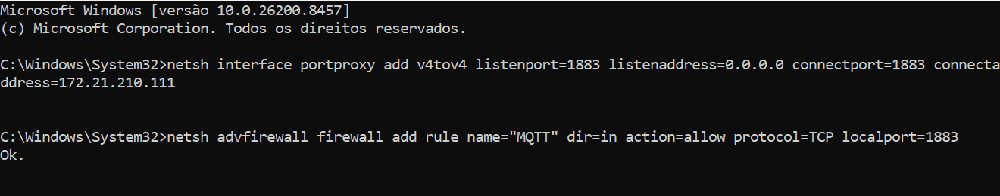
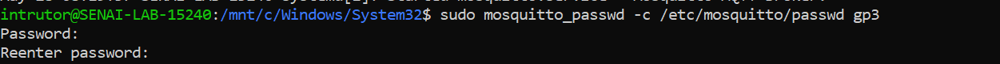
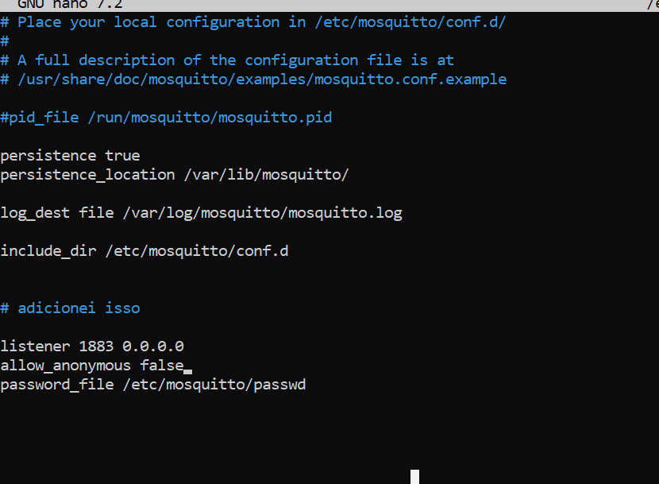
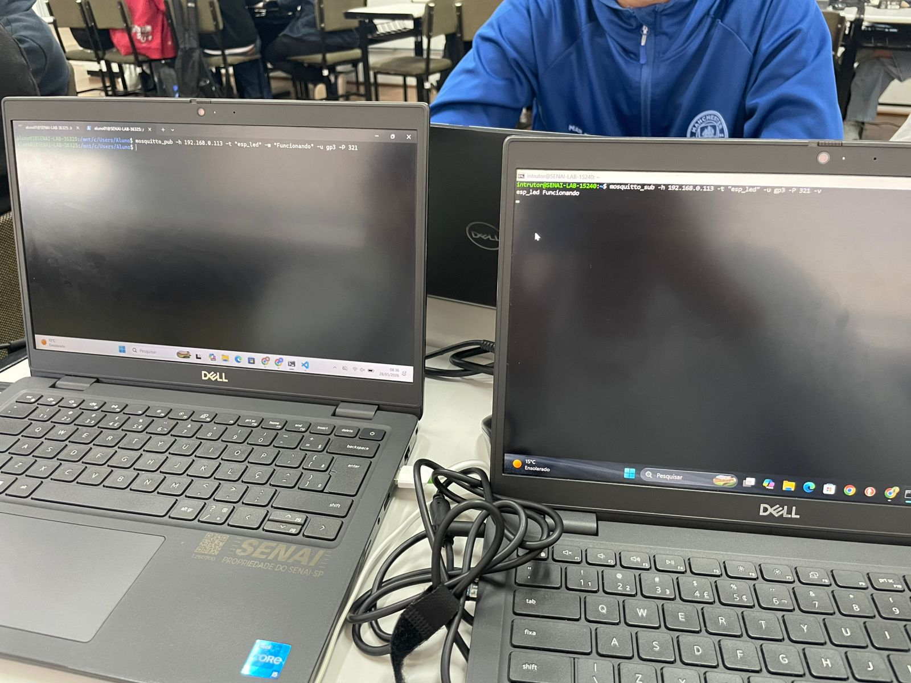

# 📡 Ecossistema MQTT

> Projeto SENAI — IoT com MQTT, ESP32 e Sistema Web

---

## 👥 Times

| Frente | Integrantes |
|---|---|
| 🔵 **Hardware / Infra** | Samuel Gracias, Gustavo Zampirom, Nicolas Luciani |
| 🟢 **Sistema Web** | Matheus Catarucci, Gabriel Leonardo, Moises Tafarello |

---

## 🔵 Frente 1 — Hardware / Infra

| Integrante | Responsabilidade |
|---|---|
| **Gustavo Zampirom** | Instalar e configurar o Mosquitto no WSL. Garantir que o broker esteja acessível na rede local e documentar o IP. |
| **Samuel Gracias** | Desenvolver o firmware C++ da ESP32. Conectar ao broker, assinar o tópico de comando e acionar o dispositivo físico. |
| **Nicolas Luciani** | Validar a comunicação com testes de pub/sub. Ser o ponto de contato com o outro grupo na Tarefa 4 (trocar IPs e tópicos). |

---

## 🟢 Frente 2 — Sistema Web

| Integrante | Responsabilidade |
|---|---|
| **Matheus Catarucci** | `app.py` (rotas FastAPI) e `server.py` (cliente MQTT em Python, pub/sub). |
| **Gabriel Leonardo** | Templates HTML com Jinja2. Página principal, exibição de estado e botões de acionamento. |
| **Moises Tafarello** | CSS e arquivos estáticos. Estilo visual da interface, feedback de estado (cores, botões). |

---

## 📐 Tópicos MQTT — Contrato entre os Times

> Ambos os times devem usar exatamente estes nomes.

| Tópico | Quem publica | Quem assina | Valores |
|---|---|---|---|
| `senai/grupo1/dispositivo/cmd` | Sistema Web | ESP32 | `ON` / `OFF` |
| `senai/grupo1/dispositivo/status` | ESP32 | Sistema Web | `ON` / `OFF` |

---

## 🚀 Como Rodar o Projeto

### Frente 1 — Subir o Broker (Gustavo)

- Etapa 1 - Instalação do wsl
    - Abra o PowerShell.
    - Vamos instalar o WSL com Ubuntu.
    - Instale o WSL `wsl --install`.
    - Após isso escolha a distribuição do Ubuntu `wsl —install -d Ubuntu`.
    - Coloque o nome do usuário e sua senha (não aparecera a senha enquanto escreve).
    - `sudo apt update && sudo apt upgrade -y` atualize o sistema.
    - Confirme se realmente é a distribuição escolhida `lsb_release -a`.

- Etapa 2 - Instalação do mosquitto
    - No PowerShell
    - Instalação do mosquitto `sudo apt install mosquitto mosquitto-clients`.
    - `mosquitto` - É o broker MQTT, ou seja, responsável por receber e distribuir mensagens entre dispositivos.

- Etapa 3 - Conexão remota
    - Para isso definimos dois terminais (Terminal 1 e Terminal 2).
    - Terminal 1 - `mosquitto_sub -h localhost -t teste`.
        - `mosquitto_sub` - para ver o que o 'Terminal 2' vai mandar.
        - `-h localhost` - aqui defini de onde a mensagem vai vir (neste caso localmente do 'Terminal 2').
        - `-t teste` - aqui define o nome do topico (neste caso 'teste').

    - Terminal 2 - `mosquitto_pub -h localhost -t teste -m "conexão_funcionando"`.
        - `mosquitto_pub` - para enviar a mensagem que ira enviar para o 'Terminal 1'.
        - `-h localhost` - aqui defini de onde a mensagem vai ir (neste caso localmente para o 'Terminal 1').
        - `-t teste` - aqui define o nome do topico (neste caso 'teste').
        - `-m "conexão_funcionando"` - aqui será a mensagem que vai ser enviada.
    
    - No Terminal 1.
    - É para aparecer - "conexão_funcionando".

- Etapa 4 - Conexão entre dois equipamento com validação.
    - Aqui ao inves de ser Terminal 1 e Terminal 2, será Note 1 e Note 2.
    - Antes de tudo, tire o firewall do Note que vai enviar a mensagem.
        - Abra o cmd como administrador.
        - `hostname -I` - pegue o seu IP.
        - `netsh interface portproxy add v4tov4 listenport=1883 listenaddress=0.0.0.0 connectport=1883 connectaddress=IP_do_computador`, depois disso `connectaddress=` adicione o IP que você pegou no primeiro comando.
        - Após isso execute, `netsh advfirewall firewall add rule name="MQTT" dir=in action=allow protocol=TCP localport=1883`.
        - Depois disso é para aparecer 'OK'.
        
    
    - Note 1
        - Esse é o que vai receber as mensagens, e vai decidir nome e senha.
        - Vamos iniciar o mosquitto.
        - `sudo service mosquitto start`
        - `sudo service mosquitto status` - para ver se está ligado.
        - Criar senha ao broker - `sudo mosquitto_passwd -c /etc/mosquitto/passwd gp3`.
        - Troque gp3 pelo nome que você deseja.
        
        - Agora precisamos dizer ao Mosquitto para parar de aceitar conexões anônimas e passar a ler o arquivo que acabamos de criar.
        - Entre no nano - `sudo nano /etc/mosquitto/mosquitto.conf`.
        - Modifique o arquivo para que ele fique exatamente assim (mude o `allow_anonymous` para `false` e adicione a linha do `password_file`)
        
        - Salve e saia (Ctrl + O, Enter, Ctrl + X).
        - Agora envie a mensagem.
        - `mosquitto_sub -h 192.168.0.113 -t "esp_led" -u gp3 -P 321 -v"`
        - `-h 192.168.0.113` - define o IP do broker MQTT.
        - `-t "esp_led"` - define o tópico utilizado.
        - `-u gp3` - define o usuário MQTT.
        - `-P 321 -v` - define a senha MQTT e exibe tópico + mensagem recebida.

    - Note 2
        - No PowerShell
        - `mosquitto_pub -h 192.168.0.113 -t “esp_led” -m "funcionou" -u gp3 -P 321`
        - Resultado:
        

### Frente 1 Finalizada!


### Frente 2 — Subir o Sistema Web (Matheus)

1. Abrir o terminal na pasta `web/`
2. Criar e ativar o ambiente virtual:
```bash
python -m venv venv
venv\Scripts\Activate.ps1
```
3. Instalar as dependências:
```bash
pip install -r requirements.txt
```
4. Colocar o IP do broker no `server.py`
5. Subir a aplicação:
```bash
uvicorn app:app --reload
```
6. Acessar `http://localhost:8000` no navegador

---

## 📋 Checklist

### 🔵 Frente 1
- [ ] **Gustavo** — Broker rodando no WSL, IP documentado
- [ ] **Samuel** — ESP32 acionando dispositivo via MQTT
- [ ] **Nicolas** — Teste de pub/sub validado + contato feito com outro grupo

### 🟢 Frente 2
- [ ] **Matheus** — `server.py` e `app.py` funcionando
- [ ] **Gabriel** — Interface exibindo estado e respondendo aos botões
- [ ] **Moises** — CSS aplicado e interface apresentável

### Geral
- [ ] Repositório no GitHub com todos os arquivos
- [ ] Acionamento remoto do dispositivo do outro grupo funcionando
- [ ] Prints/evidências adicionados ao README

---

## 📸 Evidências

| Etapa | Responsável | Print/Vídeo |
|---|---|---|
| Broker rodando no WSL | Gustavo | _(inserir)_ |
| Pub/sub no terminal | Nicolas | _(inserir)_ |
| ESP32 acionando dispositivo | Samuel | _(inserir)_ |
| Interface web funcionando | Gabriel / Moises | _(inserir)_ |
| Integração entre grupos | Nicolas / Gabriel | _(inserir)_ |

---

*SENAI — Projeto MQTT Ecossistema*
